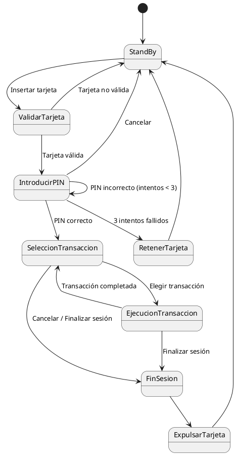

# Diagrama de Estados - Cajero Automático

## Descripción del Sistema

El sistema de cajero automático simula el proceso de interacción de un usuario con un cajero, incluyendo la validación de la tarjeta, la validación del PIN, la ejecución de transacciones y la finalización de la sesión. A través de este diagrama de estados, se describe cómo el sistema cambia de estado en función de las acciones del usuario y los eventos que ocurren durante la interacción.

## Diagrama de Estados

A continuación se muestra el diagrama de estados que describe los distintos estados y transiciones del sistema:

## Descripción de Estados y Transiciones

A continuación, se describe el flujo de estados y las transiciones del sistema:

### 1. StandBy
- **Estado inicial** del sistema.
- El sistema espera a que el usuario inserte una tarjeta.
- **Transición:**
  - **Insertar tarjeta**: Va a `ValidarTarjeta`.

### 2. ValidarTarjeta
- El sistema valida si la tarjeta insertada es válida o no.
- **Transiciones:**
  - **Tarjeta no válida**: Vuelve a `StandBy` y expulsa la tarjeta.
  - **Tarjeta válida**: Solicita al usuario que introduzca el PIN, transicionando a `IntroducirPIN`.

### 3. IntroducirPIN
- El sistema solicita al usuario que ingrese su PIN.
- **Transiciones:**
  - **PIN incorrecto** (menos de 3 intentos): Permite reintentar la introducción del PIN, manteniéndose en el estado de `IntroducirPIN`.
  - **3 intentos fallidos**: Transición a `RetenerTarjeta`, donde el sistema retiene la tarjeta y vuelve a `StandBy`.
  - **PIN correcto**: Transición a `SeleccionTransaccion`, donde el usuario puede elegir una transacción.
  - **Cancelar**: Transición a `StandBy`, donde el proceso se cancela y el sistema expulsa la tarjeta.

### 4. SeleccionTransaccion
- El usuario puede elegir una transacción a realizar o finalizar la sesión.
- **Transiciones:**
  - **Elegir transacción**: Va a `EjecucionTransaccion`, donde se ejecuta la transacción elegida.
  - **Cancelar / Finalizar sesión**: Va a `FinSesion`, terminando la interacción.

### 5. EjecucionTransaccion
- El sistema ejecuta la transacción solicitada.
- **Transiciones:**
  - **Transacción completada**: Regresa a `SeleccionTransaccion` para permitir al usuario elegir una nueva transacción.
  - **Finalizar sesión**: Va a `FinSesion`, donde se finaliza la interacción.

### 6. FinSesion
- El sistema termina la sesión y expulsa la tarjeta.
- **Transición:**
  - Va a `ExpulsarTarjeta`.

### 7. ExpulsarTarjeta
- El sistema expulsa la tarjeta del usuario y vuelve al estado inicial `StandBy`.

### 8. RetenerTarjeta
- El sistema retiene la tarjeta después de tres intentos fallidos en la validación del PIN.
- **Transición:**
  - Vuelve a `StandBy`.
