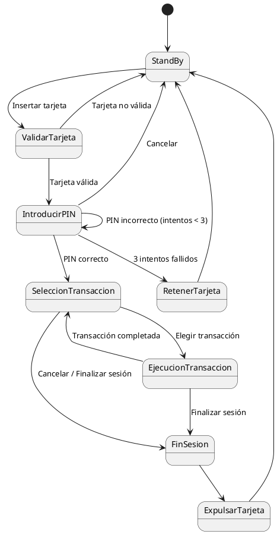

# Diagrama de Estados - Cajero Automático

## Descripción del Sistema

El sistema de cajero automático simula el proceso de interacción de un usuario con un cajero, incluyendo la validación de la tarjeta, la validación del PIN, la ejecución de transacciones y la finalización de la sesión. A través de este diagrama de estados, se describe cómo el sistema cambia de estado en función de las acciones del usuario y los eventos que ocurren durante la interacción.

El funcionamiento general de un cajero es el siguiente:

El sistema está en un estado stand-by hasta que un usuario introduce una tarjeta.
El usuario introduce la tarjeta en el sistema y el sistema valida la tarjeta. Si la tarjeta no es correcta, el sistema expulsará la tarjeta y quedará en estado stand-by. En el caso de ser una tarjeta válida, el sistema solicita al usuario que se valide mediante un PIN. 
Si hay error en el PIN, el sistema permitirá que el usuario vuelva a intentar validarse hasta completar el proceso 3 veces, en cuyo caso, si el usuario no se ha validado correctamente, finalizará el proceso, quedándose con la tarjeta. El usuario podrá cancelar el proceso de identificación en cualquier momento antes de cumplir los 3 intentos. 
Una vez el usuario se ha validado correctamente, el sistema ofrecerá al usuario las distintas transacciones que puede realizar. Cuando una transacción sea elegida, se llevará a cabo, y al finalizarla, el sistema dará la opción de poder elegir una nueva transacción o cancelar la interacción con el cajero y, por tanto, finalizar sesión. La interacción con el cajero podrá ser cancelada, finalizando la sesión, en cualquier momento siempre y cuando no esté en proceso de ejecución de una transacción.

## Diagrama de Estados

A continuación se presenta el diagrama de estados con las transiciones y condiciones que ocurren durante el uso del cajero automático.

## Descripción de Estados y Transiciones

### Elementos del Diagrama de Estados

### Estados
Los **estados** representan las diferentes situaciones o condiciones en las que el sistema puede estar en un momento dado. Cada estado describe un punto específico en el proceso, y el sistema se encuentra en un solo estado a la vez. Los estados pueden ser tanto finales (como cuando la sesión termina) como intermedios (como cuando se espera que el usuario ingrese un PIN).

**Ejemplos:**
- **StandBy:** El cajero está esperando a que el usuario inserte una tarjeta.
- **ValidarTarjeta:** El sistema valida si la tarjeta insertada es válida o no.

### Transiciones
Las **transiciones** son los cambios de un estado a otro y representan el flujo del proceso. Cada transición ocurre en función de un evento o acción que se produce en el sistema. A menudo, se asocian a condiciones que deben cumplirse para que la transición se ejecute.

**Ejemplos:**
- **StandBy --> ValidarTarjeta:** Ocurre cuando el usuario inserta una tarjeta.
- **ValidarTarjeta --> IntroducirPIN:** Ocurre cuando la tarjeta es validada como válida.

### Condiciones
Las **condiciones** definen los requisitos necesarios para que se lleve a cabo una transición entre dos estados. Estas condiciones dependen de eventos o decisiones que el sistema debe tomar en función de las entradas o acciones del usuario.

**Ejemplos:**
- **Tarjeta válida:** La tarjeta debe ser válida para que el sistema pase al estado de "IntroducirPIN".
- **PIN incorrecto:** Se requiere que el PIN ingresado sea incorrecto para que el sistema permita reintentar.

### Pseudoestados
Los **pseudoestados** son elementos en el diagrama que no representan un estado real, pero sirven para ayudar a organizar las transiciones o marcar puntos importantes dentro del flujo. El pseudoestado más común es el punto de inicio (representado por [*]), que indica el comienzo del proceso, y los puntos de finalización, como cuando la sesión se cierra.

**Ejemplos:**
- **[*] (Inicio):** Representa el comienzo del proceso del sistema, en el que el cajero espera la inserción de la tarjeta.
- **FinSesion:** El pseudoestado que indica que la sesión ha terminado y el proceso regresa a un estado inicial.

### Eventos
Los **eventos** son las acciones o sucesos que causan las transiciones entre estados. Estos eventos pueden ser la acción de un usuario, como insertar una tarjeta o ingresar un PIN, o eventos del sistema que requieren tomar una acción, como la finalización de una transacción.

**Ejemplos:**
- **Insertar tarjeta:** Es el evento que causa que el sistema pase del estado StandBy al estado ValidarTarjeta.
- **Cancelar:** Es el evento que causa que el sistema pase del estado IntroducirPIN al estado StandBy.

### Acciones
Las **acciones** son las actividades o tareas que se ejecutan cuando el sistema entra en un estado determinado o durante una transición. En un diagrama de estados, las acciones pueden estar asociadas con un estado o con una transición entre estados.

**Ejemplos:**
- **Acción en "IntroducirPIN":** El sistema muestra el campo para que el usuario ingrese su PIN.
- **Acción en "EjecucionTransaccion":** El sistema realiza la transacción seleccionada por el usuario, como un retiro o consulta de saldo.

A continuación, se describe el flujo de estados y las transiciones del sistema:

### 1. StandBy
- **Estado inicial** del sistema.
- El sistema espera a que el usuario inserte una tarjeta.
- **Transición:**
  - **Insertar tarjeta**: Va a `ValidarTarjeta`.

### 2. ValidarTarjeta
- El sistema valida si la tarjeta insertada es válida o no.
- **Transiciones:**
  - **Tarjeta no válida**: Vuelve a `StandBy` y expulsa la tarjeta.
  - **Tarjeta válida**: Solicita al usuario que introduzca el PIN, transicionando a `IntroducirPIN`.

### 3. IntroducirPIN
- El sistema solicita al usuario que ingrese su PIN.
- **Transiciones:**
  - **PIN incorrecto** (menos de 3 intentos): Permite reintentar la introducción del PIN, manteniéndose en el estado de `IntroducirPIN`.
  - **3 intentos fallidos**: Transición a `RetenerTarjeta`, donde el sistema retiene la tarjeta y vuelve a `StandBy`.
  - **PIN correcto**: Transición a `SeleccionTransaccion`, donde el usuario puede elegir una transacción.
  - **Cancelar**: Transición a `StandBy`, donde el proceso se cancela y el sistema expulsa la tarjeta.

### 4. SeleccionTransaccion
- El usuario puede elegir una transacción a realizar o finalizar la sesión.
- **Transiciones:**
  - **Elegir transacción**: Va a `EjecucionTransaccion`, donde se ejecuta la transacción elegida.
  - **Cancelar / Finalizar sesión**: Va a `FinSesion`, terminando la interacción.

### 5. EjecucionTransaccion
- El sistema ejecuta la transacción solicitada.
- **Transiciones:**
  - **Transacción completada**: Regresa a `SeleccionTransaccion` para permitir al usuario elegir una nueva transacción.
  - **Finalizar sesión**: Va a `FinSesion`, donde se finaliza la interacción.

### 6. FinSesion
- El sistema termina la sesión y expulsa la tarjeta.
- **Transición:**
  - Va a `ExpulsarTarjeta`.

### 7. ExpulsarTarjeta
- El sistema expulsa la tarjeta del usuario y vuelve al estado inicial `StandBy`.

### 8. RetenerTarjeta
- El sistema retiene la tarjeta después de tres intentos fallidos en la validación del PIN.
- **Transición:**
  - Vuelve a `StandBy`.
